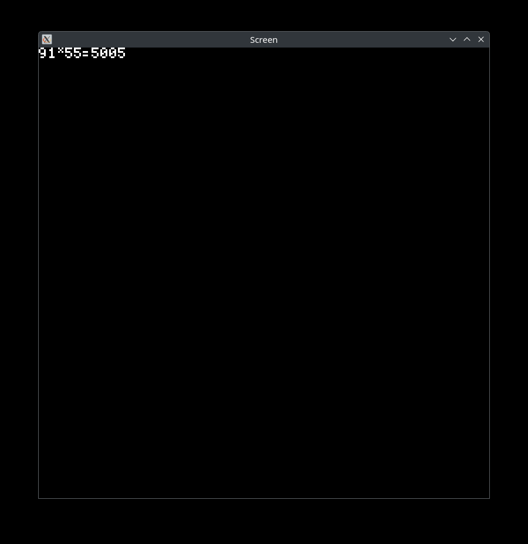

# Computer ISA Project

This is a project given as a course assignment in some university.
We started this project as a team of four, but after completing the main branch (which received full marks! 😇)
I continued working on it to turn it into a real working interactive emulator, not unlike other console emulators out there.

I changed the project documentation to align with my visions and converted it into markdown format,
if you're interested check it out here:

<b>[Documentation](DOCUMENTATION.md)</b>

The original project required working with MSVC, but since I am on a Linux machine (arch btw) 
I made it incompatible with Windows by using the X11 window system for the interactive parts.

Well, I prefer GNU C anyway. 😉
<p style="color:gray;">
<sub>(I bet you could actually make it run with WSL if you really wanted to, but i recommend just setting up a VM at this point.)</sub>
</p>

Here's a demo of it's capabilities:



## Folder Structure

Assembler - contains the assembler source code
Simulator - contains the simulator source code
bf-simp - contains the code for compiling brainfuck code to SIMP assembly
assembly_programs - contains all assembly programs
Example - contains the fibonacci example files

## Usage

On Linux, simply run the `nass` script with an assembly file:

```bash
./nass /path/to/file.asm
```

This will generate build files and execute the program automatically.

### Additional Flags

- **Compile and run Brainfuck code**:
  ```bash
  ./nass -bf /path/to/file.bf
  ```
- **Clean build and run files**:
  ```bash
  ./nass /path/to/file.asm -c
  ```
- **View usage options**:
  ```bash
  ./nass -h
  ```


If you're on Windows, you're out of luck—since this branch uses X11 calls for UI interactions.

## Known bugs and future additions

### Add support for additional features:
 - Optimizations for the brainfuck interpreter
 - Unify dmem and imem into one big chunk of memory like in actual computers, which will allow you to store programs on disk and run them.
 - Think of a way to actually do that first
 - maybe make a basic compiler to allow for easier writing of code?
